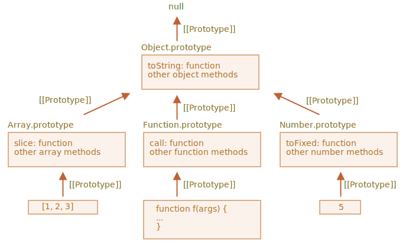

# Native prototypes

The "prototype" property is widely used by the core of JavaScript itself. All built-in constructor functions use it.

## Object.prototype

Let’s say we output an empty object:

let obj = {};
alert( obj ); // "[object Object]" ?

Where’s the code that generates the string "[object Object]"? That’s a built-in toString method, but where is it? The obj is empty!

…But the short notation obj = {} is the same as obj = new Object(), where Object is a built-in object constructor function, with its own prototype referencing a huge object with toString and other methods.

Here’s what’s going on:

When new Object() is called (or a literal object {...} is created), the [[Prototype]] of it is set to Object.prototype according to the rule that we discussed in the previous chapter:

So then when obj.toString() is called the method is taken from Object.prototype.

We can check it like this:

let obj = {};

alert(obj.**proto** === Object.prototype); // true

alert(obj.toString === obj.**proto**.toString); //true
alert(obj.toString === Object.prototype.toString); //true

Please note that there is no more [[Prototype]] in the chain above Object.prototype:
alert(Object.prototype.**proto**); // null

## Other built-in prototypes

Other built-in objects such as Array, Date, Function and others also keep methods in prototypes.

For instance, when we create an array [1, 2, 3], the default new Array() constructor is used internally. So Array.prototype becomes its prototype and provides methods. That’s very memory-efficient.

By specification, all of the built-in prototypes have Object.prototype on the top. That’s why some people say that “everything inherits from objects”.

Here’s the overall picture (for 3 built-ins to fit):

Let’s check the prototypes manually:

let arr = [1, 2, 3];

// it inherits from Array.prototype?
alert( arr.**proto** === Array.prototype ); // true

// then from Object.prototype?
alert( arr.**proto**.**proto** === Object.prototype ); // true

// and null on the top.
alert( arr.**proto**.**proto**.**proto** ); // null

Some methods in prototypes may overlap, for instance, Array.prototype has its own toString that lists comma-delimited elements:

let arr = [1, 2, 3]
alert(arr); // 1,2,3 <-- the result of Array.prototype.toString

As we’ve seen before, Object.prototype has toString as well, but Array.prototype is closer in the chain, so the array
variant is used.

In-browser tools like Chrome developer console also show inheritance (console.dir may need to be used for built-in objects):

Other built-in objects also work the same way. Even functions – they are objects of a built-in Function constructor, and their methods (call/apply and others) are taken from Function.prototype. Functions have their own toString too.

function f() {}

alert(f.**proto** == Function.prototype); // true
alert(f.**proto**.**proto** == Object.prototype); // true, inherit from objects

## Primitives

The most intricate thing happens with strings, numbers and booleans.

As we remember, they are not objects. But if we try to access their properties, temporary wrapper objects are created using built-in constructors String, Number and Boolean. They provide the methods and disappear.

These objects are created invisibly to us and most engines optimize them out, but the specification describes it exactly this way. Methods of these objects also reside in prototypes, available as String.prototype, Number.prototype and Boolean.prototype.

I) Values null and undefined have no object wrappers
Special values null and undefined stand apart. They have no object wrappers, so methods and properties are not available for them. And there are no corresponding prototypes either.

## Changing native prototypes

Native prototypes can be modified. For instance, if we add a method to String.prototype, it becomes available to all strings:

String.prototype.show = function() {
alert(this);
};

"BOOM!".show(); // BOOM!

During the process of development, we may have ideas for new built-in methods we’d like to have, and we may be tempted to add them to native prototypes. But that is generally a bad idea.

Important:
Prototypes are global, so it’s easy to get a conflict. If two libraries add a method String.prototype.show, then one of them will be overwriting the method of the other.

So, generally, modifying a native prototype is considered a bad idea.

In modern programming, there is only one case where modifying native prototypes is approved. That’s polyfilling.

Polyfilling is a term for making a substitute for a method that exists in the JavaScript specification, but is not yet supported by a particular JavaScript engine.

We may then implement it manually and populate the built-in prototype with it.

For instance:

if (!String.prototype.repeat) { // if there's no such method
// add it to the prototype

String.prototype.repeat = function(n) {
// repeat the string n times

    // actually, the code should be a little bit more complex than that
    // (the full algorithm is in the specification)
    // but even an imperfect polyfill is often considered good enough
    return new Array(n + 1).join(this);

};
}

alert( "La".repeat(3) ); // LaLaLa

## Borrowing from prototypes

That’s when we take a method from one object and copy it into another.

Some methods of native prototypes are often borrowed.

For instance, if we’re making an array-like object, we may want to copy some Array methods to it.

E.g.

let obj = {
0: "Hello",
1: "world!",
length: 2,
};

obj.join = Array.prototype.join;

alert( obj.join(',') ); // Hello,world!

It works because the internal algorithm of the built-in join method only cares about the correct indexes and the length property. It doesn’t check if the object is indeed an array. Many built-in methods are like that.

Another possibility is to inherit by setting obj.**proto** to Array.prototype, so all Array methods are automatically available in obj.

But that’s impossible if obj already inherits from another object. Remember, we only can inherit from one object at a time.
Borrowing methods is flexible, it allows to mix functionalities from different objects if needed.

## Summary

- All built-in objects follow the same pattern:
  ** The methods are stored in the prototype (Array.prototype, Object.prototype, Date.prototype, etc.)
  ** The object itself stores only the data (array items, object properties, the date)
- Primitives also store methods in prototypes of wrapper objects: Number.prototype, String.prototype and Boolean.prototype. Only undefined and null do not have wrapper objects
- Built-in prototypes can be modified or populated with new methods. But it’s not recommended to change them. The only allowable case is probably when we add-in a new standard, but it’s not yet supported by the JavaScript engine

Tasks
I) Add method "f.defer(ms)" to functions
Add to the prototype of all functions the method defer(ms), that runs the function after ms milliseconds.

After you do it, such code should work:

function f() {
alert("Hello!");
}

f.defer(1000); // shows "Hello!" after 1 second

Function.prototype.defer = function(ms) {
setTimeout(this, ms);
};

function f() {
alert("Hello!");
}

f.defer(1000); // shows "Hello!" after 1 sec

II ) Add the decorating "defer()" to functions

Add to the prototype of all functions the method defer(ms), that returns a wrapper, delaying the call by ms milliseconds.

Here’s an example of how it should work:

function f(a, b) {
alert( a + b );
}

f.defer(1000)(1, 2); // shows 3 after 1 second

Please note that the arguments should be passed to the original function.

Solution
Function.prototype.defer = function(ms) {
let f = this;
return function(...args) {
setTimeout(() => f.apply(this, args), ms);
}
};

// check it
function f(a, b) {
alert( a + b );
}

f.defer(1000)(1, 2); // shows 3 after 1 sec

Please note: we use this in f.apply to make our decoration work for object methods.

So if the wrapper function is called as an object method, then this is passed to the original method f.

Function.prototype.defer = function(ms) {
let f = this;
return function(...args) {
setTimeout(() => f.apply(this, args), ms);
}
};

let user = {
name: "John",
sayHi() {
alert(this.name);
}
}

user.sayHi = user.sayHi.defer(1000);

user.sayHi();

# Prototype methods, objects without __proto__
Setting or reading the prototype with obj.__proto__ is considered outdated and somewhat deprecated (moved to the so-called “Annex B” of the JavaScript standard, meant for browsers only).

The modern methods to get/set a prototype are:

Object.getPrototypeOf(obj) – returns the [[Prototype]] of obj.
Object.setPrototypeOf(obj, proto) – sets the [[Prototype]] of obj to proto.

The only usage of __proto__, that’s not frowned upon, is as a property when creating a new object: { __proto__: ... }.

Although, there’s a special method for this too:

Object.create(proto, [descriptors]) – creates an empty object with given proto as [[Prototype]] and optional property descriptors.

For instance:

let animal = {
  eats: true
};

// create a new object with animal as a prototype
let rabbit = Object.create(animal); // same as {__proto__: animal}

alert(rabbit.eats); // true

alert(Object.getPrototypeOf(rabbit) === animal); // true

Object.setPrototypeOf(rabbit, {}); // change the prototype of rabbit to {}

The Object.create method is a bit more powerful, as it has an optional second argument: property descriptors.
We can provide additional properties to the new object there, like this:

let animal = {
  eats: true
};

let rabbit = Object.create(animal, {
  jumps: {
    value: true
  }
});

alert(rabbit.jumps); // true
We can use Object.create to perform an object cloning more powerful than copying properties in for..in:
let clone = Object.create(
  Object.getPrototypeOf(obj), Object.getOwnPropertyDescriptors(obj)
);

This call makes a truly exact copy of obj, including all properties: enumerable and non-enumerable, data properties and setters/getters – everything, and with the right [[Prototype]].

## Brief history
