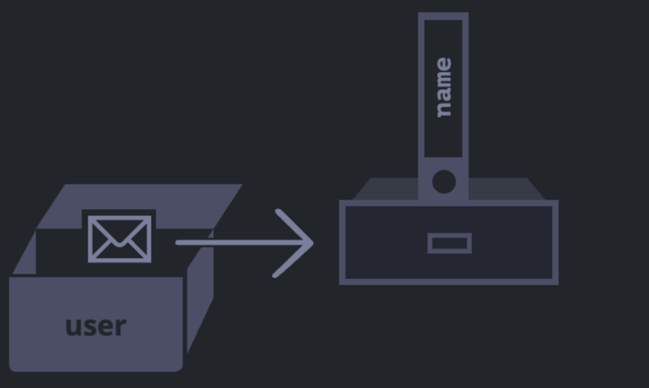

# Object

Object are non-primitive data type and for more complex data structures.
In contrast, objects are used to store keyed collections of various data and more complex entities. In JavaScript, objects penetrate almost every aspect of the language.
An object can be created with figure brackets {…} with an optional list of properties. A property is a “key: value” pair, where key is a string (also called a “property name”), and value can be anything.

An empty object can be created using one of two syntaxes:
Eg:

`let user = new Object(); // "object constructor" syntax`\
`let user = {};  // "object literal" syntax`

Usually, the figure brackets {...} are used. That declaration is called an object literal.

## Literals and properties

We can immediately put some properties into {...} as “key: value” pairs:
Eg:

`let user = {     // an object`\
`  name: "John",  // by key "name" store value "John"`\
 ` age: 30        // by key "age" store value 30`\
`};`

A property has a key (also known as “name” or “identifier”) before the colon ":" and a value to the right of it.

In the user object, there are two properties:

The first property has the name "name" and the value "John".
The second one has the name "age" and the value 30.
Property values are accessible using the dot notation:

Eg:

// get property values of the object:
`alert( user.name ); // John`\
`alert( user.age ); // 30`

The value can be of any type. Let’s add a boolean one:
`user.isAdmin = true;`

To remove a property, we can use the delete operator:
`delete user.age;`

We can also use multiword property names, but then they must be quoted:
Eg:

`let user = {`\
`  name: "John",`\
 `age: 30,`\
 `"likes birds": true  // multiword property name must be quoted`\
`}`

The last property in the list may end with a comma:
Eg:

`let user = {`\
`  name: "John",`\
`  age: 30,`\
`}`

That is called a “trailing” or “hanging” comma. Makes it easier to add/remove/move around properties, because all lines become alike.

## Square brackets

For multiword properties, the dot access doesn’t work:
// this would give a syntax error
`user.likes birds = true`

JavaScript doesn’t understand that. It thinks that we address user.likes, and then gives a syntax error when comes across unexpected birds.

The dot requires the key to be a valid variable identifier. That implies: contains no spaces, doesn’t start with a digit and doesn’t include special characters ($ and \_ are allowed).

There’s an alternative “square bracket notation” that works with any string:
Eg:

`let user = {};`\
`// set`
`user["likes birds"] = true;`\
`// get`
`alert(user["likes birds"]); // true`\
`// delete`
`delete user["likes birds"];`

Now everything is fine. Please note that the string inside the brackets is properly quoted (any type of quotes will do).
Square brackets also provide a way to obtain the property name as the result of any expression – as opposed to a literal string – like from a variable as follows:
Eg:

`let key = "likes birds";`\
`// same as user["likes birds"] = true;`\
`user[key] = true;`

Here, the variable key may be calculated at run-time or depend on the user input. And then we use it to access the property. That gives us a great deal of flexibility.

Eg:

`let user = {`\
`  name: "John",`\
`  age: 30`\
`};`\
`let key = prompt("What do you want to know about the user?", "name");`
`// access by variable`
`alert( user[key] ); // John (if enter "name")`\

The dot notation cannot be used in a similar way:
Eg:

`let user = {`\
`  name: "John",`\
`  age: 30`\
`};`\
`let key = "name";`\
`alert( user.key ) // undefined`

## Computed properties

We can use square brackets in an object literal, when creating an object. That’s called computed properties.

Eg:

`let fruit = prompt("Which fruit to buy?", "apple");`\
`let bag = {`\
`  [fruit]: 5, // the name of the property is taken from the variable fruit`\
`};`\
`alert( bag.apple ); // 5 if fruit="apple"`

The meaning of a computed property is simple: [fruit] means that the property name should be taken from fruit.

So, if a visitor enters "apple", bag will become {apple: 5}.

Essentially, that works the same as:

Eg:

`let fruit = prompt("Which fruit to buy?", "apple");`\
`let bag = {};`\
`// take property name from the fruit variable`\
`bag[fruit] = 5;`

We can use more complex expressions inside square brackets:
Eg:

`let fruit = 'apple';`\
`let bag = {`\
 ` [fruit + 'Computers']: 5 // bag.appleComputers = 5`\
`};`

Square brackets are much more powerful than dot notation. They allow any property names and variables. But they are also more cumbersome to write.

So most of the time, when property names are known and simple, the dot is used. And if we need something more complex, then we switch to square brackets.

## Property value shorthand

In real code, we often use existing variables as values for property names.

Eg:

`function makeUser(name, age) {`\
`  return {`\
`    name: name,`\
`    age: age,`\
` // ...other properties`\
`  };`\
`}`

`let user = makeUser("John", 30);`\
`alert(user.name); // John`

In the example above, properties have the same names as variables. The use-case of making a property from a variable is so common, that there’s a special property value shorthand to make it shorter.

Instead of name:name we can just write name, like this:

Eg:

`function makeUser(name, age) {`\
`  return {`\
 `  name, // same as name: name`\
 `  age,  // same as age: age`\
 `  // ...`\
`  };`\
`}`

We can use both normal properties and shorthands in the same object:
Eg:

`let user = {`\
`  name,  // same as name:name`\
`  age: 30`\
`};`

## Property names limitations

As we already know, a variable cannot have a name equal to one of the language-reserved words like “for”, “let”, “return etc. But for an object property, there’s no such restriction:

Eg:

`let obj = {`\
`  for: 1,`\
`  let: 2,`\
`  return: 3`\
`};`

`alert( obj.for + obj.let + obj.return );  // 6`

In short, there are no limitations on property names. They can be any strings or symbols (a special type for identifiers, to be covered later).

Other types are automatically converted to strings.

For instance, a number 0 becomes a string "0" when used as a property key:

Eg:

`let obj = {`\
`  0: "test" // same as "0": "test"`\
`};`

// both alerts access the same property (the number 0 is converted to string "0")
`alert( obj["0"] ); // test`\
`alert( obj[0] ); // test (same property)`

There’s a minor gotcha with a special property named **proto**. We can’t set it to a non-object value:

Eg:

`let obj = {};`\
`obj.__proto__ = 5; // assign a number`\
`alert(obj.__proto__); // [object Object] - the value is an object, didn't work as intended`

As we see from the code, the assignment to a primitive 5 is ignored.

## Property existence test, “in” operator

A notable feature of objects in JavaScript, compared to many other languages, is that it’s possible to access any property. There will be no error if the property doesn’t exist!

Reading a non-existing property just returns undefined. So we can easily test whether the property exists:
Eg:

`let user = {};`\
`alert( user.noSuchProperty === undefined ); // true means "no such property"`

There’s also a special operator "in" for that.
The syntax is:"key" in object"
Eg:

`let user = { name: "John", age: 30 };`\
`alert( "age" in user ); // true, user.age exists`\
`alert( "blabla" in user ); // false, user.blabla doesn't exist`

Please note that on the left side of in there must be a property name. That’s usually a quoted string.
If we omit quotes, that means a variable should contain the actual name to be tested.
Eg:

`let user = { age: 30 };`\
`let key = "age";`\
`alert( key in user ); // true, property "age" exists`

Why does the in operator exist? Isn’t it enough to compare against undefined?
Well, most of the time the comparison with undefined works fine. But there’s a special case when it fails, but "in" works correctly.
It’s when an object property exists, but stores undefined:

Eg:
`let obj = {`\
`  test: undefined`\
`};`

`alert( obj.test ); // it's undefined, so - no such property?`

`alert( "test" in obj ); // true, the property does exist!`

In the code above, the property obj.test technically exists. So the in operator works right.
Situations like this happen very rarely, because undefined should not be explicitly assigned. We mostly use null for “unknown” or “empty” values. So the in operator is an exotic guest in the code.

## The "for..in" loop

To walk over all keys of an object, there exists a special form of the loop: for..in. This is a completely different thing from the for(;;) construct that we studied before.

- The syntax:
  `for (key in object) {`\
  `  // executes the body for each key among object properties`\
  `}`

  Eg:

`let user = {`\
`  name: "John",`\
`  age: 30,`\
 ` isAdmin: true`\
`};`

`for (let key in user) {`\
`  // keys`\
 ` alert( key );  // name, age, isAdmin`\
`  // values for the keys`\
`  alert( user[key] ); // John, 30, true`\
`}`

Note that all “for” constructs allow us to declare the looping variable inside the loop, like let key here.
Also, we could use another variable name here instead of key. For instance, "for (let prop in obj)" is also widely used.

## Ordered like an object

Are objects ordered? In other words, if we loop over an object, do we get all properties in the same order they were added? Can we rely on this?

The short answer is: “ordered in a special fashion”: integer properties are sorted, others appear in creation order. The details follow.

As an example, let’s consider an object with the phone codes:

Eg:
`let codes = {`\
`  "49": "Germany",`\
`  "41": "Switzerland",`\
`  "44": "Great Britain",`\
`  // ..,`\
`  "1": "USA"`\
`};`

`for (let code in codes) {`\
 ` alert(code); // 1, 41, 44, 49`\
`}`

The object may be used to suggest a list of options to the user. If we’re making a site mainly for a German audience then we probably want 49 to be the first.

But if we run the code, we see a totally different picture:

USA (1) goes first
then Switzerland (41) and so on.
The phone codes go in the ascending sorted order, because they are integers. So we see 1, 41, 44, 49.

## Integer properties? What’s that?

The “integer property” term here means a string that can be converted to-and-from an integer without a change.
So, "49" is an integer property name, because when it’s transformed to an integer number and back, it’s still the same. But "+49" and "1.2" are not:

Eg:
`// Number(...) explicitly converts to a number`\
`// Math.trunc is a built-in function that removes the decimal part`\
`alert( String(Math.trunc(Number("49"))) ); // "49", same, integer property`\
`alert( String(Math.trunc(Number("+49"))) ); // "49", not same "+49" ⇒ not integer property`\
`alert( String(Math.trunc(Number("1.2"))) ); // "1", not same "1.2" ⇒ not integer property`

…On the other hand, if the keys are non-integer, then they are listed in the creation order:
Eg:
`let user = {`\
`name: "John",`\
`  surname: "Smith"`\
`};`\
`user.age = 25; // add one more`\
`// non-integer properties are listed in the creation order`\
`for (let prop in user) {`\
`  alert( prop ); // name, surname, age`\
`}`

So, to fix the issue with the phone codes, we can “cheat” by making the codes non-integer. Adding a plus "+" sign before each code is enough.
Eg:
`let codes = {`\
`  "+49": "Germany",`\
`  "+41": "Switzerland",`\
`  "+44": "Great Britain",`\
`  // ..,`\
`  "+1": "USA"`\
`};`

`for (let code in codes) {`\
`  alert( +code ); // 49, 41, 44, 1`\
`}`

## Hello, object

Write the code, one line for each action:

- Create an empty object user.
- Add the property name with the value John.
- Add the property surname with the value Smith.
- Change the value of the name to Pete.
- Remove the property name from the object.

`let user={};`\
`user.name="John";`\
`user.surname="Smith";`\
`user.name="Pete";`\
`delete user.name;`

## Check for emptiness

Write the function isEmpty(obj) which returns true if the object has no properties, false otherwise.

`let schedule = {};`\
`alert( isEmpty(schedule) ); // true`\
`schedule["8:30"] = "get up";`\
`alert( isEmpty(schedule) ); // false`

`function isEmpty(obj){`\
`for(let key in obj){`\
`return false;`\
`}`\
`return true;`\
`}`

## Sum object properties

We have an object storing salaries of our team:
let salaries = {
John: 100,
Ann: 160,
Pete: 130
}
Write the code to sum all salaries and store in the variable sum. Should be 390 in the example above.

If salaries is empty, then the result must be 0.

`let sum=0;`\
`for(let key in salaries){`\
`sum+=salaries[key];`\
`}`

`alert (sum);`

## Multiply numeric property values by 2

Create a function multiplyNumeric(obj) that multiplies all numeric property values of obj by 2.
let menu = {
width: 200,
height: 300,
title: "My menu"
};

multiplyNumeric(menu);

// after the call
`menu = {`\
`width: 400,`\
`height: 600,`\
`title: "My menu"`\
`};`

`function multiplyNumeric(obj){`\
`for (let key in obj){`\
`if(typeof obj[key]=='number'){`\
`obj[key]\*=2;`\
`}`\
`}`\
`}`

## Summary

Objects are associative arrays with several special features.

They store properties (key-value pairs), where:

- Property keys must be strings or symbols (usually strings).
- Values can be of any type.

To access a property, we can use:

- The dot notation: obj.property.
- Square brackets notation obj["property"]. Square brackets allow taking the key from a variable, like obj[varWithKey].

Additional operators:

- To delete a property: delete obj.prop.
- To check if a property with the given key exists: "key" in obj.
- To iterate over an object: for (let key in obj) loop.

What we’ve studied in this chapter is called a “plain object”, or just Object.

There are many other kinds of objects in JavaScript:

- Array to store ordered data collections,
- Date to store the information about the date and time,
- Error to store the information about an error.

# Object references and copying

One of the fundamental differences of objects versus primitives is that objects are stored and copied “by reference”, whereas primitive values: strings, numbers, booleans, etc – are always copied “as a whole value”.
Let’s start with a primitive, such as a string.

Here we put a copy of message into phrase:
Eg:
`let message = "Hello!";`\
`let phrase = message;`

A variable assigned to an object stores not the object itself, but its “address in memory” – in other words “a reference” to it.
Eg:

`let user = {`\
`  name: "John"`\
`};`\
\

The object is stored somewhere in memory, while the user variable has a “reference” to it.
We may think of an object variable, such as user, like a sheet of paper with the address of the object on it.

When we perform actions with the object, e.g. take a property user.name, the JavaScript engine looks at what’s at that address and performs the operation on the actual object.

When an object variable is copied, the reference is copied, but the object itself is not duplicated.

`let user = { name: "John" };`\
`let admin = user; // copy the reference`\
`Now we have two variables, each storing a reference to the same object:`\

## Comparison by reference

Two objects are equal only if they are the same object.

For instance, here a and b reference the same object, thus they are equal:
`let a = {};`\
`let b = a; // copy the reference`

`alert( a == b ); // true, both variables reference the same object`\
`alert( a === b ); // true`

And here two independent objects are not equal, even though they look alike (both are empty):

`let a = {};`\
`let b = {}; // two independent objects`

`alert( a == b ); // false`

For comparisons like obj1 > obj2 or for a comparison against a primitive obj == 5, objects are converted to primitives.

- Const objects can be modified
  An important side effect of storing objects as references is that an object declared as const can be modified.
  Eg:
  ` const user = {`\
   ` name: "John"`\
  `  };`

`user.name = "Pete"; // (@)`

`alert(user.name); // Pete`\
It might seem that the line (@) would cause an error, but it does not. The value of user is constant, it must always reference the same object, but properties of that object are free to change.

## Cloning and merging, Object.assign

So, copying an object variable creates one more reference to the same object.

But what if we need to duplicate an object?

We can create a new object and replicate the structure of the existing one, by iterating over its properties and copying them on the primitive level.
Eg:

`let user = {`\
`  name: "John",`\
`  age: 30`\
`};`

`let clone = {}; // the new empty object`

`// let's copy all user properties into it`\
`for (let key in user) {`\
` clone[key] = user[key];`\
`}`

`// now clone is a fully independent object with the same content`\
`clone.name = "Pete"; // changed the data in it`

`alert( user.name ); // still John in the original object`

We can also use the method Object.assign.
The syntax is:

Object.assign(dest, ...sources)

The first argument dest is a target object.
Further arguments is a list of source objects.
It copies the properties of all source objects into the target dest, and then returns it as the result.
For example, we have user object, let’s add a couple of permissions to it:

Eg:

`let user = { name: "John" };`\
`let permissions1 = { canView: true };`\
`let permissions2 = { canEdit: true };`\
`// copies all properties from permissions1 and permissions2 into user`\
`Object.assign(user, permissions1, permissions2);`\
`// now user = { name: "John", canView: true, canEdit: true }`\
`alert(user.name); // John`\
`alert(user.canView); // true`\
`alert(user.canEdit); // true`

If the copied property name already exists, it gets overwritten:
Eg:

`let user = { name: "John" };`

`Object.assign(user, { name: "Pete" });`

`alert(user.name); // now user = { name: "Pete" }`

We also can use Object.assign to perform a simple object cloning:

Eg:

`let user = {`\
`name: "John",`\
` age: 30`\
`};`

`let clone = Object.assign({}, user);`

`alert(clone.name); // John`\
`alert(clone.age); // 30`

Here it copies all properties of user into the empty object and returns it.

## Nested cloning

Until now we assumed that all properties of user are primitive. But properties can be references to other objects.

Eg:
`let user = {`\
`  name: "John",`\
` sizes: {`\
`  height: 182,`\
` width: 50`\
` }`\
`};`

`alert( user.sizes.height ); // 182`

Now it’s not enough to copy clone.sizes = user.sizes, because user.sizes is an object, and will be copied by reference, so clone and user will share the same sizes:

`let user = {`\
`  name: "John",`\
`  sizes: {`\
`    height: 182,`\
`    width: 50`\
` }`\
`};`

`let clone = Object.assign({}, user);`

`alert( user.sizes === clone.sizes ); // true, same object`

`// user and clone share sizes`\
`user.sizes.width = 60;    // change a property from one place`\
`alert(clone.sizes.width); // 60, get the result from the other one`

To fix that and make user and clone truly separate objects, we should use a cloning loop that examines each value of user[key] and, if it’s an object, then replicate its structure as well. That is called a “deep cloning” or “structured cloning. There’s structuredClone method that implements deep cloning.

## structuredClone

The call structuredClone(object) clones the object with all nested properties.
Eg:
`let user = {`\
`name: "John",`\
`sizes: {`\
` height: 182,`\
` width: 50`\
`}`\
`};`

`let clone = structuredClone(user);`

`alert( user.sizes === clone.sizes ); // false, different objects`

`// user and clone are totally unrelated now`\
`user.sizes.width = 60;    // change a property from one place`\
`alert(clone.sizes.width); // 50, not related`

The structuredClone method can clone most data types, such as objects, arrays, primitive values.

It also supports circular references, when an object property references the object itself (directly or via a chain or references).

Eg:

`let user = {};`\
`// let's create a circular reference:`\
`// user.me references the user itself`\
`user.me = user;`

`let clone = structuredClone(user);`\
`alert(clone.me === clone); // true`

As you can see, clone.me references the clone, not the user! So the circular reference was cloned correctly as well.
Although, there are cases when structuredClone fails. When an object has a function property:
Eg:

`// error`
`structuredClone({`\
`  f: function() {}`\
`});`\
Function properties aren’t supported.

## Summary

Objects are assigned and copied by reference. In other words, a variable stores not the “object value”, but a “reference” (address in memory) for the value. So copying such a variable or passing it as a function argument copies that reference, not the object itself.
All operations via copied references (like adding/removing properties) are performed on the same single object.
To make a “real copy” (a clone) we can use Object.assign for the so-called “shallow copy” (nested objects are copied by reference) or a “deep cloning” function structuredClone or use a custom cloning implementation.

# Garbage collection

## Reachability

The main concept of memory management in JavaScript is reachability.Simply put, “reachable” values are those that are accessible or usable somehow. They are guaranteed to be stored in memory.

- There’s a base set of inherently reachable values, that cannot be deleted for obvious reasons.
  1.The currently executing function, its local variables and parameters.
  2.Other functions on the current chain of nested calls, their local variables and parameters.
  3.Global variables.
  4.(there are some other, internal ones as well)
  These values are called roots.

- Any other value is considered reachable if it’s reachable from a root by a reference or by a chain of references.
  For instance, if there’s an object in a global variable, and that object has a property referencing another object, that object is considered reachable. And those that it references are also reachable.

There’s a background process in the JavaScript engine that is called garbage collector. It monitors all objects and removes those that have become unreachable.

Eg:
`let user = {`\
` name: "John"`\
`};`

The global variable "user" references the object {name: "John"} (we’ll call it John for brevity). The "name" property of John stores a primitive, so it’s painted inside the object.

Here the arrow depicts an object reference. The global variable "user" references the object {name: "John"} (we’ll call it John for brevity). The "name" property of John stores a primitive, so it’s painted inside the object.

If the value of user is overwritten, the reference is lost:
Eg:
` user = null;`

Now John becomes unreachable. There’s no way to access it, no references to it. Garbage collector will junk the data and free the memory.

## Two references

Now let’s imagine we copied the reference from user to admin:
// user has a reference to the object
Eg:
`let user = {`\
`name: "John"`\
`};`

`let admin = user;`

Now if we do the same:
Eg:

` user = null;`\
Then the object is still reachable via admin global variable, so it must stay in memory. If we overwrite admin too, then it can be removed.

## Interlinked objects

Now a more complex example. The family:

`function marry(man, woman) {`\
`woman.husband = man;`\
`man.wife = woman;`\

`return {`\
`father: man,`\
`mother: woman`
`}`\
`}`

`let family = marry({`\
`name: "John"`\
`}, {`\
`name: "Ann"`\
`});`

Function marry “marries” two objects by giving them references to each other and returns a new object that contains them both.
The resulting memory structure:

As of now, all objects are reachable.
Now let’s remove two references:

Eg:
`delete family.father;`\
`delete family.mother.husband;`

It’s not enough to delete only one of these two references, because all objects would still be reachable.

But if we delete both, then we can see that John has no incoming reference any more:

Outgoing references do not matter. Only incoming ones can make an object reachable. So, John is now unreachable and will be removed from the memory with all its data that also became unaccessible.

After garbage collection:

## Unreachable island

It is possible that the whole island of interlinked objects becomes unreachable and is removed from the memory.
The source object is the same as above. Then:
Eg:
`family = null;`
The in-memory picture becomes:

This example demonstrates how important the concept of reachability is.
It’s obvious that John and Ann are still linked, both have incoming references. But that’s not enough.
The former "family" object has been unlinked from the root, there’s no reference to it any more, so the whole island becomes unreachable and will be removed.

## Internal algorithms

The basic garbage collection algorithm is called “mark-and-sweep”. The following “garbage collection” steps are regularly performed:

- The garbage collector takes roots and “marks” (remembers) them.
- Then it visits marked objects and marks their references. All visited objects are remembered, so as not to visit the same object twice in the future.
- …And so on until every reachable (from the roots) references are visited.
- All objects except marked ones are removed.

For instance, let our object structure look like this:

We can clearly see an “unreachable island” to the right side. Now let’s see how “mark-and-sweep” garbage collector deals with it.

The first step marks the roots:

…And continue to follow further references, while possible:

Then we follow their references and mark referenced objects:

JavaScript engines apply many optimizations to make it run faster and not introduce any delays into the code execution.

Some of the optimizations:

- Generational collection – objects are split into two sets: “new ones” and “old ones”. In typical code, many objects have a short life span: they appear, do their job and die fast, so it makes sense to track new objects and clear the memory from them if that’s the case. Those that survive for long enough, become “old” and are examined less often.

- Incremental collection – if there are many objects, and we try to walk and mark the whole object set at once, it may take some time and introduce visible delays in the execution. So the engine splits the whole set of existing objects into multiple parts. And then clear these parts one after another. There are many small garbage collections instead of a total one. That requires some extra bookkeeping between them to track changes, but we get many tiny delays instead of a big one.

- Idle-time collection – the garbage collector tries to run only while the CPU is idle, to reduce the possible effect on the execution.

## Summary

The main things to know:

Garbage collection is performed automatically. We cannot force or prevent it.
Objects are retained in memory while they are reachable.
Being referenced is not the same as being reachable (from a root): a pack of interlinked objects can become unreachable as a whole, as we’ve seen in the example above.

# Object methods, "this"

Objects are usually created to represent entities of the real world, like users, orders and so on:
For a start, let’s teach the user to say hello:

Eg:
`let user = {`\
` name: "John",`\
` age: 30`\
`};`

`user.sayHi = function() {`\
`alert("Hello!");`\
`};`

`user.sayHi(); // Hello!`

Here we’ve just used a Function Expression to create a function and assign it to the property user.sayHi of the object.Then we can call it as user.sayHi(). The user can now speak!

### A function that is a property of an object is called its method.

So, here we’ve got a method sayHi of the object user.
Of course, we could use a pre-declared function as a method, like this:

Eg:
`let user = {`\
` name: "John",`\
` age: 30`\
`};`

`// first, declare`\
`function sayHi() {`\
`  alert("Hello!");`\
`}`

`// then add as a method`\
`user.sayHi = sayHi;`\

`user.sayHi(); // Hello!`\

## Object-oriented programming

When we write our code using objects to represent entities, that’s called object-oriented programming, in short: “OOP”.

## Method shorthand

There exists a shorter syntax for methods in an object literal:
Eg:

`// these objects do the same`
`user = {`\
`sayHi: function() {`\
` alert("Hello");`\
`}`\
`};`

`// method shorthand looks better, right?`
`user = {`\
`sayHi() { // same as "sayHi: function(){...}"`\
`alert("Hello");`\
`}`\
`};`

As demonstrated, we can omit "function" and just write sayHi().

## “this” in methods

It’s common that an object method needs to access the information stored in the object to do its job.
For instance, the code inside user.sayHi() may need the name of the user.
To access the object, a method can use the this keyword.
The value of this is the object “before dot”, the one used to call the method.
For instance:
Eg:
`let user = {`\
`name: "John",`\
`age: 30,`

`  sayHi() {`\
// "this" is the "current object"
`alert(this.name);`\
`}`

`};`

`user.sayHi(); // John`\
Here during the execution of user.sayHi(), the value of this will be user.
Technically, it’s also possible to access the object without this, by referencing it via the outer variable:

`let user = {`\
`name: "John",`\
`age: 30,`

`  sayHi() {`\
`alert(user.name); // "user" instead of "this"`\
`}`

`};`\
…But such code is unreliable. If we decide to copy user to another variable, e.g. admin = user and overwrite user with something else, then it will access the wrong object.
That’s demonstrated below:

Eg:
`let user = {`\
` name: "John",`\
`  age: 30,`

` sayHi() {`\
`  alert( user.name ); // leads to an error`\
`  }`

`};`

`let admin = user;`\
`user = null; // overwrite to make things obvious`

`admin.sayHi();`\

If we used this.name instead of user.name inside the alert, then the code would work.

## “this” is not bound

In JavaScript, keyword this behaves unlike most other programming languages. It can be used in any function, even if it’s not a method of an object.
There’s no syntax error in the following example:
Eg:
`function sayHi() {`\
`  alert( this.name );`\
`}`

The value of this is evaluated during the run-time, depending on the context.
For instance, here the same function is assigned to two different objects and has different “this” in the calls:
Eg:

`let user = { name: "John" };`\
`let admin = { name: "Admin" };`

`function sayHi() {`\
`  alert( this.name );`\
`}`

`// use the same function in two objects`\
`user.f = sayHi;`\
`admin.f = sayHi;`\

// these calls have different this
// "this" inside the function is the object "before the dot"
`user.f(); // John  (this == user)`\
`admin.f(); // Admin  (this == admin)`\

`admin['f'](); // Admin (dot or square brackets access the method – doesn't matter)`

The rule is simple: if obj.f() is called, then this is obj during the call of f. So it’s either user or admin in the example above.

### Calling without an object: this == undefined

We can even call the function without an object at all:
Eg:
`    function sayHi() {`\
`  alert(this);`\
`}`

`sayHi(); // undefined`

In this case this is undefined in strict mode. If we try to access this.name, there will be an error.
In non-strict mode the value of this in such case will be the global object (window in a browser, we’ll get to it later in the chapter Global object). This is a historical behavior that "use strict" fixes.
Usually such call is a programming error. If there’s this inside a function, it expects to be called in an object context.

### The consequences of unbound this

If you come from another programming language, then you are probably used to the idea of a "bound this", where methods defined in an object always have this referencing that object.

In JavaScript this is “free”, its value is evaluated at call-time and does not depend on where the method was declared, but rather on what object is “before the dot”.

The concept of run-time evaluated this has both pluses and minuses. On the one hand, a function can be reused for different objects. On the other hand, the greater flexibility creates more possibilities for mistakes.

Here our position is not to judge whether this language design decision is good or bad. We’ll understand how to work with it, how to get benefits and avoid problems.

## Arrow functions have no “this”

Arrow functions are special: they don’t have their “own” this. If we reference this from such a function, it’s taken from the outer “normal” function.
For instance, here arrow() uses this from the outer user.sayHi() method:

Eg:
`let user = {`\
`  firstName: "Ilya",`\
`  sayHi() {`\
`    let arrow = () => alert(this.firstName);`\
`    arrow();`\
`  }`\
`};`

`user.sayHi(); // Ilya`\
That’s a special feature of arrow functions, it’s useful when we actually do not want to have a separate this, but rather to take it from the outer context.

#### Using "this" in object literal

Here the function makeUser returns an object.
What is the result of accessing its ref? Why?

Eg:
`function makeUser() {`\
`  return {`\
`    name: "John",`\
`    ref: this`\
`  };`\
`}`

`let user = makeUser();`

`alert( user.ref.name ); // Error: Cannot read property 'name' of undefined`

Answer: an error.

That’s because rules that set this do not look at object definition. Only the moment of call matters.
Here the value of this inside makeUser() is undefined, because it is called as a function, not as a method with “dot” syntax.
The value of this is one for the whole function, code blocks and object literals do not affect it.
So ref: this actually takes current this of the function.

We can rewrite the function and return the same this with undefined value:

Eg:
`function makeUser(){`\
`  return this; // this time there's no object literal`\
`}`

`alert( makeUser().name ); // Error: Cannot read property 'name' of undefined`

As you can see the result of alert( makeUser().name ) is the same as the result of alert( user.ref.name ) from the previous example.
Here’s the opposite case:
Eg:

`function makeUser() {`\
` return {`\
` name: "John",`\
`  ref() {`\
`   return this;`\
`  }`\
` };`\
`}`

`let user = makeUser();`\

`alert( user.ref().name ); // John`\
Now it works, because user.ref() is a method. And the value of this is set to the object before dot ..

#### Create a calculator

Create an object calculator with three methods:
read() prompts for two values and saves them as object properties with names a and b respectively.
sum() returns the sum of saved values.
mul() multiplies saved values and returns the result.

`let calculator = {`\
`sum(){`\
`return this.a + this.b;`\
`},`\
`mul(){`\
`return this.a * this.b;`\
`},`\
`read(){`\
`this.a = +prompt('a?', 0);`\
`this.b = +prompt('b?', 0);`\
`}`\
`};`

`calculator.read();`\
`alert( calculator.sum() );`\
`alert( calculator.mul() );`

#### Chaining

There’s a ladder object that allows to go up and down:

` let ladder = {`\
`  step: 0,`\
`  up() {`\
`    this.step++;`\
`  return this;`\
`  },`\
`  down() {`\
`    this.step--;`\
 ` return this;`\
`  },`\
`  showStep: function() { // shows the current step`\
`    alert( this.step );`\
 ` return this;`\
`  }`\
`};`

`ladder.up();`\
`ladder.up();`\
`ladder.down();`\
`ladder.showStep(); // 1`\
`ladder.down();`\
`ladder.showStep(); // 0`

`ladder.up().up().down().showStep().down().showStep(); // shows 1 then 0`
